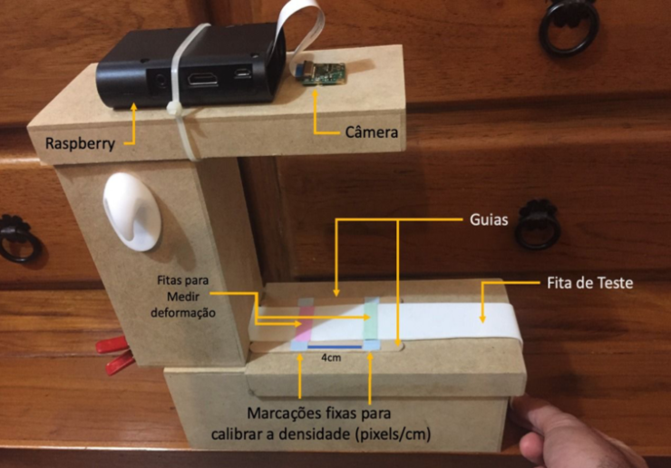
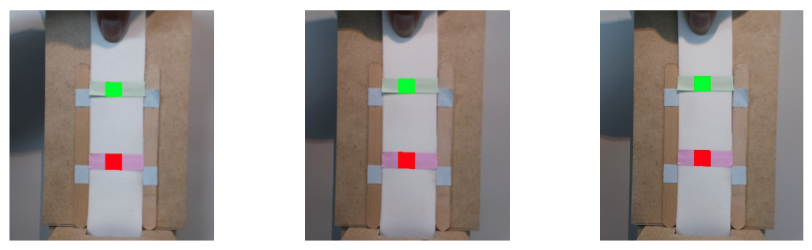

# Medição da Deformação de um Material Flexível por Imagens

Este repositório contém os resultados do projeto para medir a variação de comprimento de um material flexível por imagem. O projeto foi realizado pelo Grupo 02 da disciplina de Análise de Imagens do Instituto de Computação da UFF durante o segundo semestre de 2019.

O vídeo a seguir resume algumas informações do projeto e como utilizar o software:

## Equipamento Utilizado na Medição

A figura a seguir ilustra o equipamento utilizado para medir a deformação do material:

## Resultados
 
Após construir o conjunto composto da estrutura e do software de medição, foram executados dois tipos de teste, o primeiro foi baseado na medição da deformação a partir da captura em vídeo.
 
O segundo teste se baseou em três fotos e em que cada uma delas a fita recebeu uma tensão em uma de suas extremidades, se deslocando respectivamente 10, 20 e 30 pixels em relação a posição inicial.

As três figuras a seguir representam, cada uma delas uma das fotos utilizadas para a medição no segundo teste.

As formas quadriláteras nas fotos, nas cores verde e vermelho mais intensos, representam as áreas identificadas pelo software que foram a base para medir a distância entre as duas fitas:

Durante o segundo teste foram obtidos os seguintes resultados:

Distância entre as fitas de medição

1) Distância entre as fitas de medicão na posicão inicial: 218 pixels
2) Distância entre as fitas de medicão na posição 1: 222 pixels
3) Distância entre as fitas de medicão na posição 2: 225 pixels
4) Distância entre as fitas de medicão na posição 3: 226 pixels

Coeficientes de deformação (distancia atual - distancia incial / distancia inicial)

1) Coeficiente de deformação na posição 1: 0,018
2) Coeficiente de deformação na posição 2: 0,032
3) Coeficiente de deformação na posição 3: 0,037

## Técnicas Utilizadas

O algoritmo utilizado pelo software pode ser descrito de forma simplicada em 4 etapas:

1. Segmentar a fita verde e a fita rosa.
2. Calcular o centróide de cada uma delas.
3. Calcular a distância euclidiana entre os dois centróides para obter a distância inicial.
4. A medida que a fita é deformada calcular a nova distância entre os dois centróides para identificar a variação.

Alguns 
 
- Definição de uma região de interesse (ROI) para otimizar o processamento;
- Reconhecimento das cores dos pontos de deformação utilizando modelo de cor HSV;
- Limiarização para segmentar as fitas verde e rosa coladas no EVA.
 